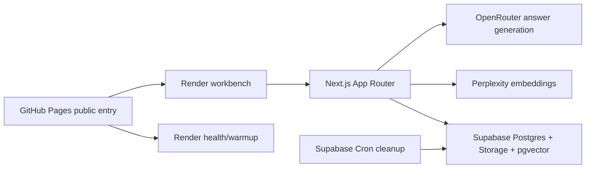

# RAG Lens

**Retrieve, inspect, understand RAG.**

RAG Lens is a practical RAG debugger for developers and reviewers. Choose a
first-party example corpus or upload a small temporary document, ask a question,
then inspect the retrieval trace that produced the answer.

[Public entry target](https://lagarcess.github.io/rag-lens/) |
[View source](https://github.com/lagarcess/rag-lens)

The Slice 11 public share URL is GitHub Pages. This branch adds the static
public-entry page under `docs/`; after merge, enable GitHub Pages from `/docs`
on `main`. Render is the app/backend sandbox origin that the public entry warms
before opening the workbench.


## Why It Exists

RAG Play is educational because it shows a pipeline. RAG Lens takes the next
step: it lets you inspect, debug, and understand a real RAG app built on your
own docs.

The first screen is a workbench, not a marketing page. A visitor can use seeded
examples with no setup, or create a short-lived anonymous upload session for a
small PDF, text, or markdown file.

## What You Will Learn

- How extraction, chunking, embeddings, retrieval, prompt assembly, and answer
  generation connect in a standard RAG loop.
- Why retrieved chunks are selected or ignored, using rank, similarity score,
  source document, chunk index, and citation metadata.
- How `top_k`, chunk size, overlap, and embedding profile choices affect
  retrieved evidence and prompt length.
- Where RAG failure modes appear: weak similarity, missing context, oversized
  chunks, unsupported uploads, and locked indexing settings.
- How to keep provider keys server-side while still offering a public demo with
  anonymous uploads.

## Demo Flow

1. After GitHub Pages is enabled from `/docs` on `main`, open the public entry:
   [https://lagarcess.github.io/rag-lens/](https://lagarcess.github.io/rag-lens/).
2. Choose **Open workbench**. The landing page warms the Render sandbox when
   the public-entry implementation is deployed.
3. Select a first-party example corpus, or upload a small `.pdf`, `.txt`, `.md`,
   or `.markdown` file for a temporary anonymous session.
4. Ask a question.
5. Read the answer and citations.
6. Inspect the trace: extraction, chunking, retrieval scores, selected context,
   prompt assembly, provider metadata, and timing.
7. Adjust supported retrieval settings, compare the variant trace, and delete
   the anonymous session when done.

## Architecture Highlights



- **Public entry:** GitHub Pages is the portfolio URL to share.
- **Sandbox origin:** Render hosts the Next.js workbench and server routes.
- **Vector store:** Supabase Postgres with `pgvector` stores example vectors,
  upload chunks, queries, retrieval rows, and trace history.
- **Embeddings:** Perplexity embeddings are decoded, normalized, and stored
  server-side before vector search.
- **Answers:** OpenRouter generates grounded answers from selected chunks when
  configured; local fallback behavior keeps development flows usable.
- **Retention:** Supabase Cron and the cleanup Edge Function purge abandoned
  upload data; delete-now attempts immediate session-scoped cleanup.

## Privacy And Rate Limits

RAG Lens is a public demo, not a long-term knowledge base.

- Do not upload secrets, private files, personal data, or regulated data.
- Anonymous uploads are limited to 3 files and 10 MB total per session.
- Supported upload types are PDF, plain text, markdown, and `.markdown`.
- Uploaded files, extracted text, chunks, embeddings, queries, retrieval rows,
  and traces carry `session_id`, `expires_at`, and `hard_expires_at`.
- Session access expires quickly. Delete-now ends the session and attempts
  immediate Storage-before-database cleanup.
- Abandoned uploaded data becomes purge-eligible after about 24 hours and is
  physically removed by monthly Supabase cleanup.
- Public session, upload, query, provider, and database paths use in-memory
  per-instance throttles as a V1 abuse brake. This is not a distributed
  production rate-limit system.
- `SUPABASE_SERVICE_ROLE_KEY`, `PERPLEXITY_API_KEY`, and
  `OPENROUTER_API_KEY` never belong in browser code.

## Quickstart

```bash
bun install
cp .env.example .env
bun run dev
```

Open `http://localhost:3000`.

For zero-dependency local example traces, set:

```bash
RAG_RETRIEVAL_BACKEND=local
```

For hosted-style retrieval and uploads, configure Supabase, Perplexity, and
OpenRouter env vars, then use:

```bash
RAG_RETRIEVAL_BACKEND=supabase
CHAT_PROVIDER=openrouter
```

See [docs/ENVIRONMENT.md](docs/ENVIRONMENT.md) and
[docs/DEPLOYMENT.md](docs/DEPLOYMENT.md) for the full environment checklist.

## Environment

Browser-safe values:

- `NEXT_PUBLIC_SITE_URL`
- `NEXT_PUBLIC_SUPABASE_URL`
- `NEXT_PUBLIC_SUPABASE_PUBLISHABLE_KEY`

Server-only values:

- `SUPABASE_URL`
- `SUPABASE_SERVICE_ROLE_KEY`
- `SUPABASE_STORAGE_BUCKET`
- `PERPLEXITY_API_KEY`
- `CHAT_PROVIDER=openrouter`
- `OPENROUTER_API_KEY`
- `OPENROUTER_CHAT_MODEL`

Operational controls:

- `RAG_RETRIEVAL_BACKEND`
- `RAG_SESSION_SOFT_TTL_HOURS`
- `RAG_SESSION_HARD_TTL_HOURS`
- `RAG_RATE_LIMIT_*`
- `CLEANUP_BATCH_SIZE`

`SUPABASE_PROJECT_REF` is intentionally omitted from runtime env lists. Use it
only for local Supabase CLI linking.

## Useful Commands

```bash
bun test
bun run lint
bun run build
bun run seed:examples
bun run preflight:render
bun run smoke:supabase -- --json
bun run smoke:supabase:integration -- --json
bun run cleanup:sessions:dry-run
bun run cleanup:sessions
```

## Portfolio Narrative

RAG Lens is built to demonstrate production-adjacent AI engineering, not just a
chat UI:

- It ships the full standard RAG loop from ingestion to answer generation.
- It exposes the trace: chunks, scores, prompts, citations, timings, and model
  metadata.
- It uses real hosted infrastructure: GitHub Pages for the public entry, Render
  for the sandbox, Supabase Storage/Postgres/`pgvector` for data and retrieval,
  Perplexity for embeddings, and OpenRouter for answer generation.
- It keeps examples first-party so visitors can try the debugger without
  uploading private files.
- It treats anonymous public uploads as temporary demo data with explicit
  limits, immediate delete, expiry, and scheduled cleanup.

## Repository Presentation

Recommended GitHub repo metadata after the public-entry branch lands:

- **Homepage:** `https://lagarcess.github.io/rag-lens/`
- **Description:** `Inspect, debug, and understand a real RAG app built on your own docs.`
- **Topics:** `rag`, `rag-debugger`, `retrieval-augmented-generation`,
  `vector-search`, `pgvector`, `supabase`, `nextjs`, `openrouter`,
  `perplexity`, `ai-engineering`
- **Social preview:** use a trace-inspector-focused image derived from the
  actual workbench, not stock art. The current source screenshot is
  `docs/assets/screenshots/workbench.png`.

## Current Status

- Public entry target:
  [https://lagarcess.github.io/rag-lens/](https://lagarcess.github.io/rag-lens/)
- Repository: [lagarcess/rag-lens](https://github.com/lagarcess/rag-lens)
- Render sandbox/backend origin:
  `https://rag-lens-mx20.onrender.com`
- Supabase: hosted project in the dedicated `RAG Lens` organization.

Working locally against the hosted Supabase project:

- Anonymous session creation and delete-now cleanup.
- Example corpus retrieval.
- Upload, extraction, chunking, embedding, vector storage, and retrieval for
  markdown, text, and PDF files.
- OpenRouter-backed answers when `CHAT_PROVIDER=openrouter` and
  `OPENROUTER_API_KEY` are configured.
- Persisted upload-session traces that can be reopened while the session is
  active.
- Expired-session cleanup dry run, manual cleanup script, and Supabase monthly
  cleanup path.

## Known Limitations

- GitHub Pages must be enabled from `/docs` on `main` after this branch merges;
  until then, the Pages URL may still show GitHub's default 404.
- Contextualized embedding comparison is implemented at the client/API contract
  level, but seeded/uploaded vectors currently use the default standard vector
  profile. Re-indexed profile comparison is deferred.
- Uploaded-document comparisons are query-time only for V1. Changing chunk
  size, overlap, or embedding mode after upload requires future re-indexing
  support.
- In-memory API throttles are a V1 public-demo brake per app instance, not a
  distributed production rate-limit system.
- There is no account system or long-term personal knowledge base in V1.

## Project Docs

- [DESIGN.md](DESIGN.md) - visual design system.
- [docs/PROJECT_LOCK.md](docs/PROJECT_LOCK.md) - locked decisions and execution
  discipline.
- [docs/PRODUCT.md](docs/PRODUCT.md) - product promise and scope.
- [docs/ROADMAP.md](docs/ROADMAP.md) - end-to-end implementation slices.
- [docs/ARCHITECTURE.md](docs/ARCHITECTURE.md) - system architecture and
  boundaries.
- [docs/DATA_MODEL.md](docs/DATA_MODEL.md) - Supabase schema and retention
  model.
- [docs/API_CONTRACT.md](docs/API_CONTRACT.md) - app route/API surface.
- [docs/SECURITY_PRIVACY.md](docs/SECURITY_PRIVACY.md) - public upload and
  secret-handling rules.
- [docs/DEPLOYMENT.md](docs/DEPLOYMENT.md) - Supabase, Render, and public entry
  setup.
- [docs/TESTING.md](docs/TESTING.md) - verification strategy.
