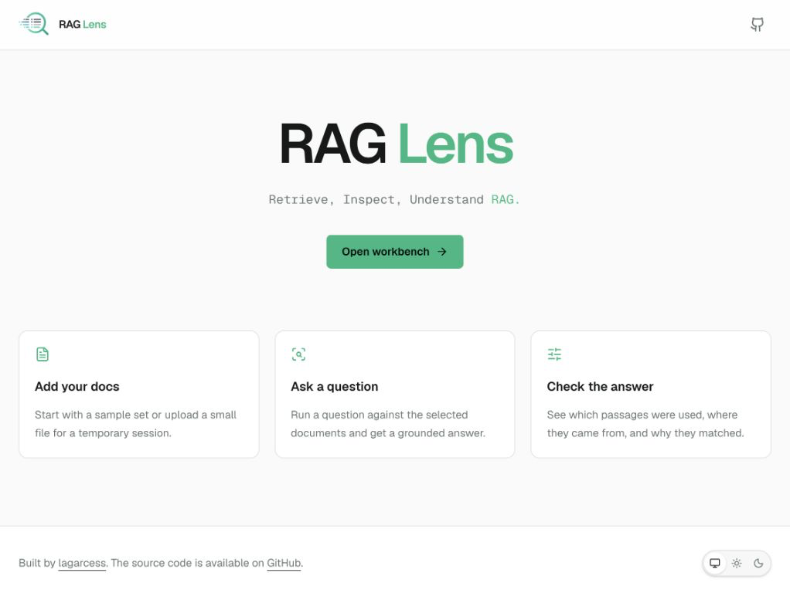
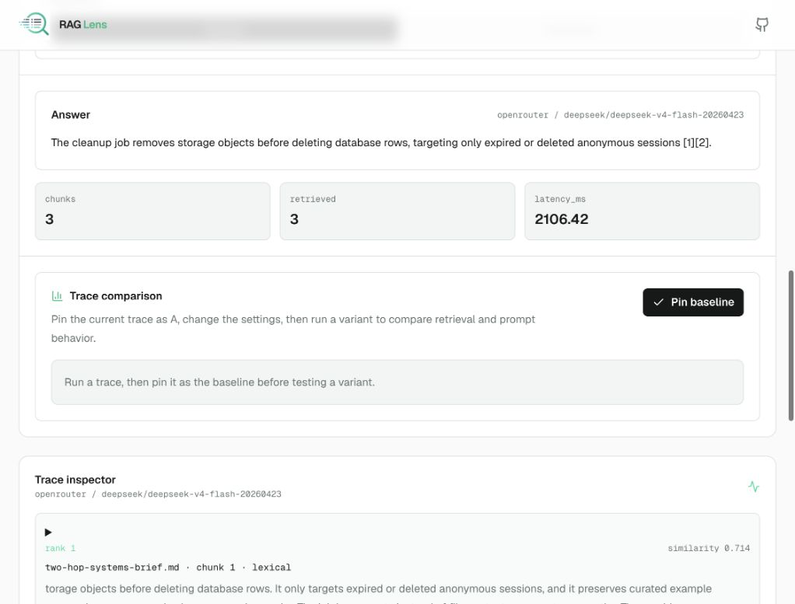
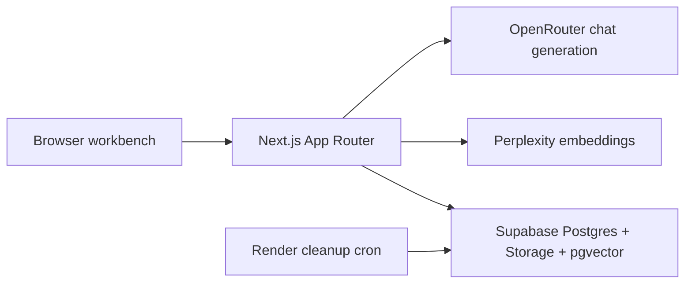

# RAG Lens

RAG Lens is a practical RAG debugger: choose example documents or upload your
own, ask a question, and inspect the trace that produced the answer.

It is inspired by RAG Play's educational clarity, but it takes a different
angle. RAG Play shows the pipeline as a demo. RAG Lens turns the pipeline into a
workbench with session-scoped documents, Supabase vector retrieval, persisted
traces, and OpenRouter answer generation.

## Screenshots





## What It Demonstrates

- Temporary anonymous uploads with size limits and cleanup.
- Curated first-party example corpora for visitors who do not have files ready.
- RAG trace inspection: extraction, chunking, embeddings, retrieval scores,
  prompt assembly, response, and citations.
- Retrieval experiments for chunk size, overlap, top-k, and supported embedding
  profiles.
- Server-side provider boundaries so Supabase service keys, Perplexity keys,
  and OpenRouter keys never reach the browser.

## Demo Flow

1. Open the landing page and choose **Open workbench**.
2. Select an example corpus or upload a small `.pdf`, `.txt`, or `.md` file.
3. Ask a question.
4. Read the grounded answer and citations.
5. Open the trace inspector to review ranked chunks, similarity scores, prompt
   assembly, and model metadata.
6. Adjust retrieval settings and compare the trace when the selected source
   supports that profile.

## Architecture



The long-term public entry point is a static GitHub Pages landing page that
warms a Render-hosted sandbox. That topology is documented but deferred; the
current app runs as a Next.js full-stack service.

## Stack

- Next.js App Router, React, TypeScript, Tailwind CSS.
- Bun for package management and scripts.
- Supabase Storage, Postgres, and `pgvector`.
- Perplexity embeddings.
- OpenRouter chat generation.
- Render web service plus cleanup cron.

## Getting Started

```bash
bun install
cp .env.example .env
bun run dev
```

Open `http://localhost:3000`.

The app can run a local lexical example trace with `RAG_RETRIEVAL_BACKEND=local`.
Full uploads, Supabase vector retrieval, model-backed embeddings, trace
persistence, and cleanup need the hosted-service env vars below.

For Render-hosted V1, use `RAG_RETRIEVAL_BACKEND=supabase`; the dedicated RAG
Lens Supabase project has seeded example vectors, and uploaded documents are
always indexed into Supabase.

## Environment

Browser-safe values:

- `NEXT_PUBLIC_SITE_URL`
- `NEXT_PUBLIC_SUPABASE_URL`
- `NEXT_PUBLIC_SUPABASE_PUBLISHABLE_KEY`

Server-only values:

- `SUPABASE_URL`
- `SUPABASE_SERVICE_ROLE_KEY`
- `SUPABASE_STORAGE_BUCKET`
- `PERPLEXITY_API_KEY`
- `CHAT_PROVIDER=openrouter`
- `OPENROUTER_API_KEY`
- `OPENROUTER_CHAT_MODEL`

Operational controls:

- `RAG_RETRIEVAL_BACKEND`
- `RAG_SESSION_SOFT_TTL_HOURS`
- `RAG_SESSION_HARD_TTL_HOURS`
- `RAG_RATE_LIMIT_*`
- `CLEANUP_BATCH_SIZE`

`SUPABASE_PROJECT_REF` is intentionally omitted from runtime env lists. Use it
only for local Supabase CLI linking.

See [docs/ENVIRONMENT.md](docs/ENVIRONMENT.md) and
[docs/DEPLOYMENT.md](docs/DEPLOYMENT.md) for the full list.

## Useful Commands

```bash
bun test
bun run seed:examples
bun run cleanup:sessions:dry-run
bun run cleanup:sessions
bun run lint
bun run build
```

## Current Status

- GitHub: [lagarcess/rag-lens](https://github.com/lagarcess/rag-lens)
- Supabase: hosted project in the dedicated `RAG Lens` organization.
- Render: blueprint validates and is configured for Supabase vector retrieval,
  but deployment is blocked until a dedicated RAG Lens Render workspace is
  available. Do not attach services to existing unrelated Render workspaces.

Working locally against the hosted Supabase project:

- Anonymous session creation and delete-now cleanup.
- Example corpus retrieval.
- Upload, extraction, chunking, embedding, vector storage, and retrieval for
  markdown, text, and PDF files.
- OpenRouter-backed answers when `CHAT_PROVIDER=openrouter` and
  `OPENROUTER_API_KEY` are configured.
- Persisted upload-session traces that can be reopened while the session is
  active.
- Expired-session cleanup dry run and destructive cleanup script.

## Known Limitations

- Contextualized embedding comparison is implemented at the client/API contract
  level, but seeded/uploaded vectors currently use the default standard vector
  profile. Re-indexed profile comparison is deferred.
- Public GitHub Pages landing and Render warmup flow are documented but not yet
  built.
- The in-memory API throttles are a V1 abuse brake per app instance, not a
  distributed rate-limit system.
- There is no account system or long-term personal knowledge base in V1.

## Project Docs

- [DESIGN.md](DESIGN.md) - visual design system.
- [docs/PROJECT_LOCK.md](docs/PROJECT_LOCK.md) - locked decisions and execution
  discipline.
- [docs/PRODUCT.md](docs/PRODUCT.md) - product promise and scope.
- [docs/ROADMAP.md](docs/ROADMAP.md) - end-to-end implementation slices.
- [docs/ARCHITECTURE.md](docs/ARCHITECTURE.md) - system architecture and
  boundaries.
- [docs/DATA_MODEL.md](docs/DATA_MODEL.md) - Supabase schema and retention
  model.
- [docs/API_CONTRACT.md](docs/API_CONTRACT.md) - app route/API surface.
- [docs/SECURITY_PRIVACY.md](docs/SECURITY_PRIVACY.md) - public upload and
  secret-handling rules.
- [docs/DEPLOYMENT.md](docs/DEPLOYMENT.md) - Supabase and Render setup.
- [docs/TESTING.md](docs/TESTING.md) - verification strategy.
