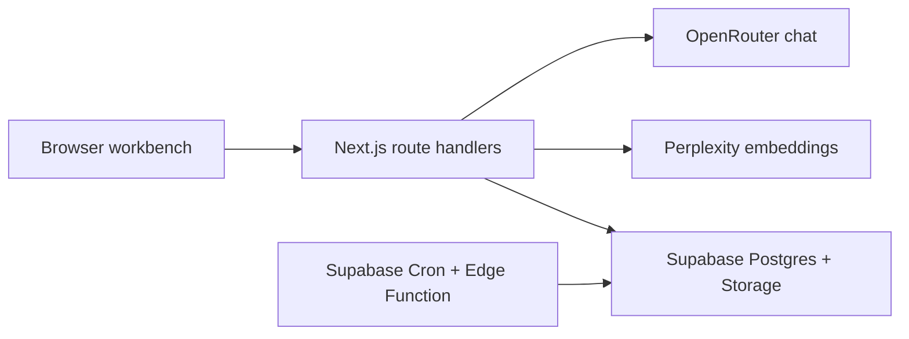
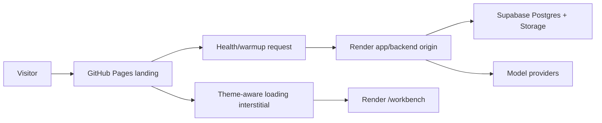

# Architecture

## Core Shape

RAG Lens is a Next.js full-stack app designed to deploy on Render.

## Public Entry Topology

The shareable portfolio URL is a static GitHub Pages landing page, not the
Render app URL. Render is the application/API origin that powers the sandbox
after the visitor chooses to open it.

The landing page quietly warms the Render service after first paint, keeps the
CTA on the static page, and shows a theme-aware RAG Lens loading state if the
sandbox is still starting. The Render URL should remain unlisted and should not
be used as the public link in the README, portfolio, or social posts.

## Runtime Boundaries

### Browser

- Renders workbench UI.
- Holds anonymous `session_id`.
- Never sees service-role, Perplexity, or OpenRouter keys.
- Uploads only through app routes.

### Next.js Server

- Validates env and input.
- Uses Supabase service role from server-only env.
- Calls Perplexity for document and query embeddings.
- Calls OpenRouter for final answer generation.
- Assembles prompts and stores traces.
- Owns upload, ingestion, retrieval, generation, and cleanup endpoints.

### Supabase

- Storage bucket for uploaded files.
- Postgres tables for sessions, corpora, documents, chunks, queries, and retrievals.
- pgvector for vector search.
- RLS enabled on app tables; V1 access goes through server routes.
- Monthly Cron invokes the cleanup Edge Function for abandoned upload purge.

### Render

- Web service runs the Next.js app.
- App origin is warmed by the GitHub Pages landing and is not the public share
  URL.

## Why TypeScript First

V1 does not need a Python worker. Keeping ingestion, retrieval, and trace logic in TypeScript reduces deployment surface area and lets the app ship sooner. If PDF extraction becomes unreliable in Node, add a Poetry-managed Python worker as a later slice.

## Key Decisions

- Default embedding dimension is 1024 using Perplexity 0.6b embedding models.
- OpenRouter answer generation is enabled when `CHAT_PROVIDER=openrouter` and
  `OPENROUTER_API_KEY` are configured; the V1 hosted model is
  `deepseek/deepseek-v4-flash`.
- Keep model reasoning disabled by default for low-cost, predictable RAG answers; expose it later as an experiment control.
- Store normalized float vectors in `extensions.vector(1024)`.
- Use cosine distance (`<=>`) in Supabase.
- Use `RAG_RETRIEVAL_BACKEND=local` for zero-dependency local example traces
  and `RAG_RETRIEVAL_BACKEND=supabase` for hosted V1.
- Use examples by default; uploads are optional and expiring.
- Keep long-lived personal knowledge bases out of V1.
- Keep `pdf-parse` external to the Next.js production server bundle so PDF
  extraction uses native Node resolution in route handlers.
