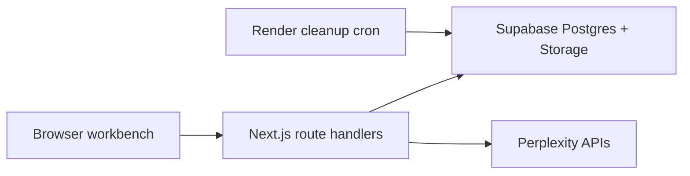

# Architecture

## Core Shape

rag-lens is a Next.js full-stack app deployed on Render.

## Runtime Boundaries

### Browser

- Renders workbench UI.
- Holds anonymous `session_id`.
- Never sees service-role keys or Perplexity keys.
- Uploads only through app routes.

### Next.js Server

- Validates env and input.
- Uses Supabase service role from server-only env.
- Calls Perplexity APIs.
- Assembles prompts and stores traces.
- Owns upload, ingestion, retrieval, generation, and cleanup endpoints.

### Supabase

- Storage bucket for uploaded files.
- Postgres tables for sessions, corpora, documents, chunks, queries, and retrievals.
- pgvector for vector search.
- RLS enabled on app tables; V1 access goes through server routes.

### Render

- Web service runs the Next.js app.
- Cron job runs `bun run cleanup:sessions` every 30 minutes.

## Why TypeScript First

V1 does not need a Python worker. Keeping ingestion, retrieval, and trace logic in TypeScript reduces deployment surface area and lets the app ship sooner. If PDF extraction becomes unreliable in Node, add a Poetry-managed Python worker as a later slice.

## Key Decisions

- Default embedding dimension is 1024 using Perplexity 0.6b embedding models.
- Store normalized float vectors in `extensions.vector(1024)`.
- Use cosine distance (`<=>`) in Supabase.
- Use examples by default; uploads are optional and expiring.
- Keep long-lived personal knowledge bases out of V1.
